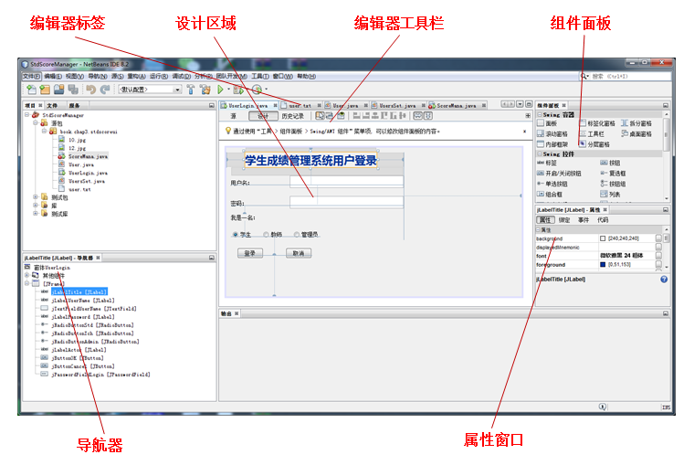

# NetBeans

## Table of Contents
- [概述](#概述)
	- [图形化编程简介](#图形化编程简介)
	- [Java Swing](#Java Swing)
	- [第一个java swing程序 ](#第一个java swing程序 )
- [Swing基础](#Swing基础)

- [文本区域](#文本区域)

---------------------------------------------------------------------

## 1. 概述
### 1.1 简介
NetBeans是开源软件开发集成环境，是一个开放框架，可扩展的开发平台，可以用于Java、C/C++，PHP等语言的开发，本身是一个开发平台，可以通过扩展插件来扩展功能.
本篇介绍的就是 使用NetBeans开发Java的Swing应用程序
### 1.2 安装
* 官方网址: https://netbeans.org/
* 安装包下载地址: https://netbeans.org/downloads/

* Linux
略
* Windows
首先确保JDK环境的正常工作, 然后下载exe安装包, 形如: netbeans-8.0.1-javase-windows.exe
按照Windows平台的软件安装方法进行安装.

### 1.3 NetBeans界面介绍
NetBeans的GUI构建器的界面简要介绍如下:

### 1.4 在NetBeans中创建项目
#### 创建项目
1. [文件]->[新建项目]->(类别-Java节点)->(项目-Java应用程序)->[下一步]
2. (项目名称-输入项目名称)->(指定项目位置-输入项目位置)->
3. 使用专用文件夹存储库保留为取消状态->
4. 创建主类保留为选中状态->
5. [完成]

### 1.5 NetBeans中的帮助

## 2. Swing基础组件

## 3. Swing事件处理
### 3.1 Swing GUI事件处理步骤
(1) 定义一个XxxEvent事件类, 描述GUI的Xxx事件  --Swing已定义
(2) 定义一个事件处理器接口 XxxListener, 声明所有与该事件相关的处理方法  --Swing已定义
(3) 在触发事件的组件中定义处理Xxx事件的注册方法addXxxListener和注销方法removeXxxListener.  --Swing已定义
(4) 编写实现事件监听器接口的类, 实现具体的事件处理方法. --自己实现

## 4. Swing布局设计

## 5. Swing容器的使用

## 6. Swing对话框与选择器

## 7. Swing菜单的设计

## 8. Swing表格组件

## 9. Swing树设计

## 10. 系统资源的使用
